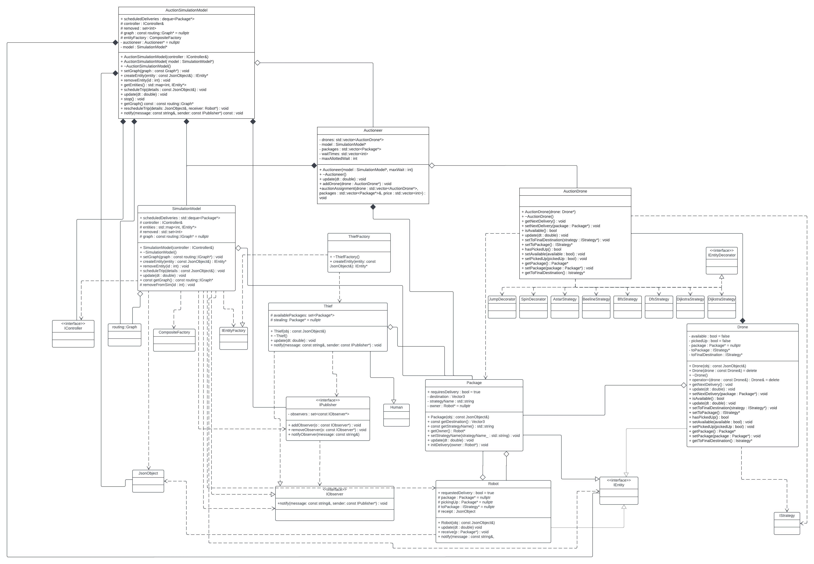

# Team 001-46 Final Drone Simulation Project

## Team 001-46 Members
- Logan Krant (KRANT115)
- Alexander Lovely (LOVEL170)
- Samuel Martin (MART6353)
- Wyatt Rasmussen (RASMU984)

## Project Overview
The goal of this project is to simulate a drone-based package delivery system on the University of Minnesota campus, including the ability to schedule deliveries using different path-finding algorithms and watch deliveries play out on an interactive 3D model of the campus. 

## Running the Simulation
Due to various dependencies, it is recommended that the project is run on a CSE lab machine. After accessing a lab machine and cloning the project enter the project directory and run the command:
```
make run -j
```
This command will build the project and start the server on the default port for the project,4041. Once the terminal prints 'starting server...', the simulation can be accessed at http://localhost:4041. 

## Simulation Functionality
Upon launching the simulation, the browser-based visualization will become available. In this simulation, a human, drone, and helicopter are all spawned. The user can use the keyboard and mouse the navigate the 3D map of campus and interact with the simulation. On the left side of the menu, the user can view logs posted by the various entities in the simulation. On the right side, there is a menu for controlling various aspects of the simulation. A change view option allows the user to select an entity to focus the simulation camera on, the simulation speed slider alters how fast the time is moving, the show all routes button overlays the map with a visualization of the entire routing graph, and buttons are present for scheduling deliveries, adding entities (humans, thieves, and drones), and stopping the simulation. 

When any of the add entity buttons are clicked, an entity of the corresponding type is added to the map and will begin running through its default behavior automatically. When the stop simulation is clicked, the server shuts down.

When schedule delivery is clicked, a menu appears where the user can name their delivery and the pathfinder strategy that is to be used by the delivery drone. To set the pick-up and drop-off locations for the package, the user must click on the simulation map twice, first to set the pick-up the location and the second for the drop-off. The locations will be highlighted with translucent beacons to indicate where the drone is set to go. When the delivery is submitted, all set data is sent to the server and a package is created at the pick-up location. A robot is created at a random spot on the map to represent the recipient of the delivery.

At this point, using an auctioneer system, an available drone is selected to carry out the delivery, using the pathfinding strategy previously chosen. The drone will move to the pick-up location and take the package to the drop-off location. When the package is dropped off, the recipient is alerted and will move to it. At this point, the drone is available for more deliveries.

While the package has been dropped off but not collected, any thief entity that gets near the package will see it and go to it. If a thief reaches a package before the robot does, the package is stolen. When the robot arrives at the site of the stolen package, the robot reorders the package and the same steps are carried out. If the robot arrives first, it successfully receives the package.

Multiple drones, thieves, and deliveries can be carried out simultaneously within the simulation. In addition to the entities that have important functionality in the simulation, the helicopter and human entities move around the map randomly.
. 
### Feature Addition: Auctioneer
This feature replaces the stock FIFO scheduling algorithm in SimulationModel with an Auctioneer that insteads holds auctions for multiple packages at once. This is interesting because it saves on distance that the drones need to travel, which in a real-world system would help decreace costs.

This adds to the existing work by extending the SimulationModel and Drone files and using a mediator inbetween them to house the Auctioneer. Due to this, there is nothing special the user needs to interact with the auctioneer as it is the new way that all scheduling occurs.

### Feature Addition: Porch Pirates
Porch pirates adds a new entity that appears and acts like a human... most of the time. They spawn randomly around the superblock area and will move around the map randomly. When they get close to a package that has been dropped off, they will run towards it and steal it. They then return to normal speed to not raise suspicions. Robots now spawn randomly in the general area around a package and when the package gets dropped off they go to retrieve it. If it gets stolen by the pirate before then, the robot will report their package as stolen and have the simulation reordered with priority delivery (priority in the sense that the drone goes straight to the package and straight to the drop off, it doesn't get higher queue priority). 

It's interesting because it better simulates the real world. Package stealing is a real thing (just ask Mark Rober). It also works like real life because often either the company you bought from or the shipping company will replace the stolen package which is what happens in our simulation. It adds to the existing work by adding a new entity and a new factory for the entity. It extends the functionality of the observer to be able to identify who the sender of the message was, which makes it more useful as a class. We used the observer design pattern to be able to notify the thieves of available packages to steal and the robots of stolen packages. 

It's not possible to purposefully invoke the features of this addition, but spawning plenty of thieves increases the chances greatly for watching this happen. This is why a spawn thief button was added to the simulation. Just click the button plenty of times and schedule a delivery. Having the drop off close to the quad and then spawning a bunch of thieves right after scheduling will almost guarantee a stolen package.

## Sprint Retrospective
### Scrum Lord: Alexander Lovely
### What went well
- Our initial outline on Jira was essential for dividing up the work for each extension and ensuring that everyone pulled their weight.
- Using the Agile format allowed our subteams to keep track of each other, and ensure that we were meeting the deadline.
- The "In Review" portion of the Jira table ensured that code pushed to the branch had been peer reviewed for potential sources of error.

### What didn't go well
- As a group of four members that needed to make two extensions, we made the logical decision to split into two teams to work on each part individually. Because of this, communication between subteams was rare, and this led to significant issues when merging the two extension branches into the development branch. This project also came during one of the busiest parts of the semester, and so we ended up utilizing an informal Agile format as opposed to using Jira or a more visual/formal alternative for the sake of time.

### Improving our development process
- Had we spent more time committing to writing tasks and requirements on Jira, I think we could have implemented and maintained the Agile framework for a longer period of time. Despite our busy schedules, it would have been possible to spend half an hour or so to work on the tasks and adjust things as necessary. While we were able to finish the project without much issue, our strategy to do so would be less effective if the project were larger or the tasks more numerous.

## UML Diagram


## Links
- UML Diagram: https://lucid.app/lucidchart/9656b572-35a2-47dd-8ceb-62c8ffc38e45/edit?invitationId=inv_2705e6ac-677c-4c5f-89db-c8ef6f50534b
- Docker: https://hub.docker.com/repository/docker/why002/csci3081w-final-project-team-001-046/general
- YouTube: https://www.youtube.com/watch?v=Pgps2fONjlk
